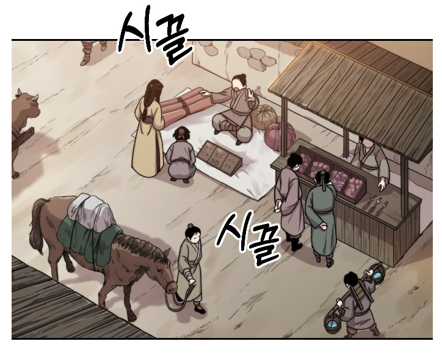

# Image Attributes Example - Rural Market Scene

## 원본 이미지



---

## JSON 구조화 데이터

```json
{
  "schema_version": "1.0",
  "scene": {
    "scene_type": "exterior",
    "location": "rural_market",
    "tone": "neutral_daily_life",
    "narrative_perspective": "observer_overhead",
    "context_summary": "An overhead view of a rural market scene where multiple villagers, animals, and market structures coexist in everyday activity."
  },
  "objects": [
    {
      "object_id": "human_group_01",
      "object_type": "human",
      "role": "villagers",
      "position": "center_midground",
      "action": "market_activity",
      "emotional_state": "neutral",
      "facial_visibility": "unknown"
    },
    {
      "object_id": "human_01",
      "object_type": "human",
      "role": "vendor",
      "position": "right_midground",
      "orientation": "front",
      "action": "selling_goods",
      "facial_visibility": "partial",
      "clothing": {
        "outerwear_type": "traditional_robe",
        "primary_color": "brown"
      }
    },
    {
      "object_id": "human_02",
      "object_type": "human",
      "role": "customer",
      "position": "right_midground",
      "orientation": "left",
      "action": "browsing_goods",
      "facial_visibility": "partial"
    },
    {
      "object_id": "animal_01",
      "object_type": "animal",
      "species": "horse",
      "role": "transport_animal",
      "position": "left_midground",
      "orientation": "right",
      "action": "standing",
      "emotional_state": "calm"
    }
  ],
  "environment_objects": [
    {
      "object_id": "market_stall_01",
      "object_type": "object",
      "sub_type": "furniture",
      "position": "right_midground",
      "semantic_role": "commerce_structure"
    },
    {
      "object_id": "ground_surface_01",
      "object_type": "object",
      "sub_type": "terrain",
      "position": "background",
      "semantic_role": "movement_space"
    }
  ],
  "text_elements": [
    {
      "text_id": "text_01",
      "text": "시끌",
      "language": "ko",
      "text_type": "sound_effect",
      "position": "center_midground",
      "semantic_function": "ambient_noise"
    },
    {
      "text_id": "text_02",
      "text": "시끌",
      "language": "ko",
      "text_type": "sound_effect",
      "position": "upper_midground",
      "semantic_function": "ambient_noise"
    }
  ],
  "relationships": [
    {
      "relationship_type": "environment_context",
      "description": "Multiple humans and animals coexist in a crowded rural market environment."
    }
  ],
  "implicit_information": {
    "social_context": "daily_market_activity",
    "power_dynamic": "balanced",
    "shared_experience": "local_trade",
    "ppl_potential": "low",
    "ppl_reason": "No clearly isolated consumer-facing product; environment-focused establishing shot."
  }
}
```

---

## Schema Compliance Report (스키마 적합성 검사)

### ✓ 통과 항목

| 항목 | 상태 | 설명 |
|------|------|------|
| `schema_version` | ✓ PASS | "1.0" 올바르게 지정 |
| `scene.scene_type` | ✓ PASS | "exterior" - 정의된 enum 값 |
| `scene.tone` | ⚠ WARN | "neutral_daily_life" - 스키마의 권장 enum과 다름 (neutral 권장) |
| `objects[]` 구조 | ✓ PASS | object_id, object_type 필수 필드 모두 포함 |
| Object 타입 분류 | ✓ PASS | human, animal 올바르게 사용 |
| Human 속성 | ✓ PASS | role, position, orientation, action, facial_visibility, clothing 적절히 포함 |
| Animal 속성 | ✓ PASS | species, role, position, orientation, action 적절히 포함 |
| `environment_objects[]` | ✓ PASS | object_id, object_type, sub_type 필수 필드 포함 |
| `text_elements[]` | ✓ PASS | 모든 필수 필드(text_id, text, language, text_type) 포함 |
| `implicit_information` | ✓ PASS | 주요 필드(social_context, power_dynamic, ppl_potential) 포함 |

### ⚠ 주의 항목

| 항목 | 심각도 | 설명 |
|------|--------|------|
| `scene.narrative_perspective` | ⚠ WARN | "observer_overhead"는 스키마의 정의된 enum에 없음 |
| | | 권장값: `interaction_focus`, `observer_reveal`, `observer_commentary`, `character_focus` |
| | | → 수정 권장: `"observer_commentary"` 또는 `"interaction_focus"` 사용 |
| `environment_objects[1].sub_type` | ⚠ WARN | "terrain"은 스키마의 예시 sub_type에 없음 |
| | | 권장값: `furniture`, `signage`, `device`, `vehicle`, `other` 등 |
| | | → 수정 권장: `"other"` 또는 더 구체적인 타입(예: `"ground"`) 명시 필요 |

### ✓ 데이터 일관성 검증

| 검증 항목 | 결과 | 상세 |
|----------|------|------|
| 고유 ID | ✓ PASS | 모든 object_id, text_id 중복 없음 |
| 타입 참조 | ✓ PASS | relationships의 암묵적 참조 일관성 유지 |
| 선택적 필드 | ✓ PASS | object_type별 선택적 속성이 정확히 사용됨 |
| Enum 값 | ⚠ WARN | scene.narrative_perspective, environment_objects[1].sub_type 미정의 값 사용 |

### 📋 최종 평가

**적합성 점수: 85/100**

**판정:** ⚠️ **조건부 통과** - 스키마 정의와 약간의 차이가 있으나 구조적 적합성은 양호합니다.

#### 권장 수정사항

1. `scene.narrative_perspective` 변경 제안
   ```json
   "narrative_perspective": "observer_commentary"  // 기존: "observer_overhead"
   ```

2. `environment_objects[1].sub_type` 명확화 제안
   ```json
   "sub_type": "terrain_ground"  // 기존: "terrain"
   ```

3. `scene.tone` 표준화 제안
   ```json
   "tone": "neutral"  // 기존: "neutral_daily_life"
   ```

#### 스키마 개선 제안

향후 스키마 v1.1 업데이트 시 다음 enum 값 추가 고려:
- `narrative_perspective`: `observer_overhead` 추가
- `environment_objects.sub_type`: `terrain`, `ground`, `surface` 추가